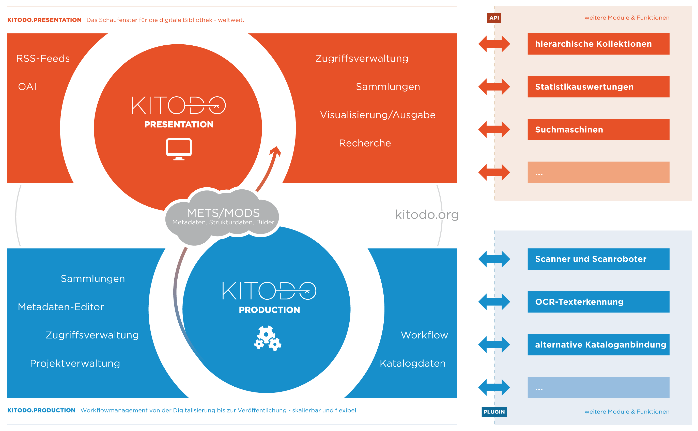

# Tutorials für Kitodo
Dieses Repository beinhaltet Schritt-für-Schritt-Anleitungen für exemplarische Arbeitsschritte mit der Software Kitodo, einer Softwaresuite zur Digitalisierung von Kulturgut.

## Tutorials

Die Workflowkomponente von Kitodo (Kitodo.production) wird derzeit in einem [DFG-Projekt](https://www.kitodo.org/software/entwicklung/dfg-projekt/) umfangreich weiterentwickelt, weshalb sich die Tutorials für die Versionen 2 (stabil) und 3 (in Entwicklung) wesentlich unterscheiden:

* **[Tutorial für Kitodo 2.x](kitodo2/README.md)**
  * entstand anlässlich des [Workshops "Kitodo for newbies"](http://www.kitodo.org/news/2018/03/07/workshop-kitodo-for-newbies/) am 11./12.6.2018 an der TU Berlin
* **Tutorial für Kitodo 3.x**
  * geplant für einen weiteren Workshop am 10./11.9.2018

Im Folgenden finden Sie zum Einstieg einige allgemeine Informationen zu Kitodo.

## Struktur

Zwei zentrale Komponenten: Kitodo.production und Kitodo.presentationen, die durch weitere Module & Funktionen erweitert werden können.

Relativ neu: Kitodo.publication sowie Unterstützung LZA

## Interesse?

Dann lesen Sie hier weiter:

- **[Tutorial für Kitodo 2.x](kitodo2/README.md)**
  - entstand anlässlich des [Workshops "Kitodo for newbies"](http://www.kitodo.org/news/2018/03/07/workshop-kitodo-for-newbies/) am 11./12.6.2018 an der TU Berlin.
- **Tutorial für Kitodo 3.x**
  - geplant für einen weiteren Workshop am 10./11.9.2018

## Feedback erwünscht!

Verbesserungsvorschläge und Korrekturen über GitHub [Issues](https://github.com/felixlohmeier/kitodo-tutorials/issues) oder [Pull Requests](https://github.com/felixlohmeier/kitodo-tutorials/pulls) und natürlich gerne auch [persönlich](https://felixlohmeier.de/).

## Lizenz

Dieses Werk ist lizenziert unter einer [Creative Commons Namensnennung 4.0 International Lizenz](http://creativecommons.org/licenses/by/4.0/).

