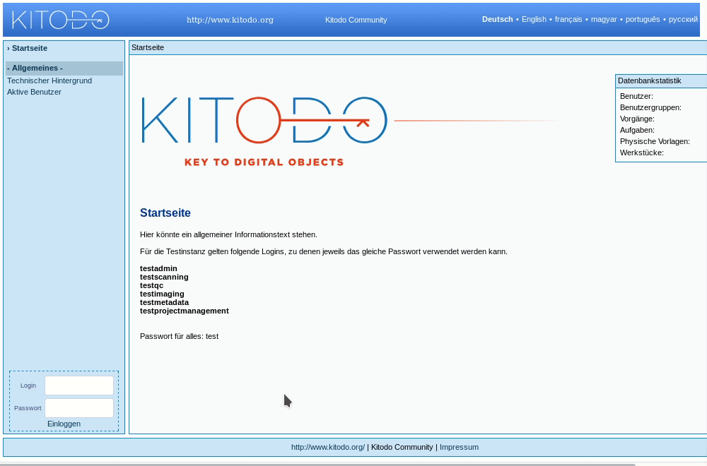

[kitodo-tutorials](../README.md) » [kitodo2](README.md) » 02_projekt-anlegen.md

# Projekt anlegen

Projekte in Kitodo.Production dienen der Verwaltung der Zugriffsbeschränkungen und projektbezogenen statistischen Auswertungen. Mehrere Projekte sind in der Regel dann notwendig, wenn Berichtspflichten bestehen.

Wir erstellen zunächst ein neues Projekt für unseren Workshop. Für diesen Schritt werden Administrationsrechte benötigt:

- Demo-Server von Zeutschel: http://kitodo.zeutschel.de/kitodo-production/newpages/Main.jsf
- Login: `testAdmin`
- Passwort: `test`

## Aufgabe: Projekt anlegen

* Menüpunkt Administration / `Projekte` aufrufen, dort Link `Neues Projekt anlegen` klicken und folgende Angaben vornehmen:
  * Reiter Details
    * Titel: `Workshop20180611` (um Kollisionen auf dem Demo-Server zu vermeiden, verwenden Sie bitte das aktuelle Datum)
  * Reiter Technische Daten
    * Internes Speicherformat: `Mets`
    * DMS Exportformat: `Mets`
    * Automatischer DMS-Export: (ja)
    * DMS-Export-Ordner für XML-Datei: `/mnt/data/var/zedExporter/new`
    * DMS-Export-Images-Ordner:  `/mnt/data/var/zedExporter/new`
    * DMS-Export-Success-Ordner: `/mnt/data/var/zedExporter/new`
    * DMS-Export-Error-Ordner: `/mnt/data/var/zedExporter/new`
    * Erzeuge Vorgangsordner: (nein)
    * Zeitüberschreitung (ms): `3600000`
  * Reiter Mets Parameter
    * METS Rechteinhaber: `Digital Library Kitodo`
    * METS Rechteinhaber Logo: `http://kitodo.zeutschel.de/dlf/fileadmin/template/img/logo-zeutschel.png`
    * METS Rechteinhaber URL: `http://www.zeutschel.de`
    * METS Rechteinhaber Kontakt: `info@zeutschel.com`
    * METS Digiprov Referenz: `http://gateway-bayern.de/$(meta.CatalogIDDigital)`
    * METS Digiprov Präsentation: `http://kitodo.zeutschel.de/dlf/resolve?id=$(meta.CatalogIDDigital)`
    * METS Digiprov Referenz (Anker): `http://gateway-bayern.de/$(meta.topstruct.CatalogIDDigital)`
    * METS Digiprov Präsentation (Anker): `http://kitodo.zeutschel.de/dlf/resolve?id=$(meta.topstruct.CatalogIDDigital)`
    * METS Pointer Pfad: `http://kitodo.zeutschel.de/content/$(meta.CatalogIDDigital)/$(meta.topstruct.CatalogIDDigital).xml`
    * METS Pointer Pfad (Anker): `http://kitodo.zeutschel.de/content/$(meta.firstchild.CatalogIDDigital)/$(meta.topstruct.CatalogIDDigital).xml `
    * METS PURL (logische Struktur): `http://kitodo.zeutschel.de/dlf/resolve?id=$(meta.CatalogIDDigital)`
    * METS Dateigruppen: Über `Link Dateigruppe hinzufügen` Folgendes anlegen
      * Name: `DOWNLOAD`
        * Pfad: `http://kitodo.zeutschel.de/content/$(meta.CatalogIDDigital)/pdf/`
        * Mime Typ: `application/pdf`
        * Suffix: `pdf`
      * Name: `THUMBS`
        * Pfad: `http://kitodo.zeutschel.de/content/$(meta.CatalogIDDigital)/jpgs/thumbs/`
        * Mime Typ: `image/jpeg`
        * Suffix: `jpg`
      * Name: `MAX`
        * Pfad: `http://kitodo.zeutschel.de/content/$(meta.CatalogIDDigital)/jpgs/max/`
        * Mime Typ: `image/jpeg`
        * Suffix: `jpg`
      * Name: `DEFAULT`
        * Pfad: `http://kitodo.zeutschel.de/content/$(meta.CatalogIDDigital)/jpgs/default/`
        * Mime Typ: `image/jpeg`
        * Suffix: `jpg`
      * Name: `FULLTEXT`
        * Pfad: `http://kitodo.zeutschel.de/content/$(meta.CatalogIDDigital)/ocr/alto/`
        * Mime Typ: `text/xml`
        * Suffix: `xml`
        * Validierung gegen Ordner: `getAltoDirectory`

## Literatur

* Anwenderdokumentation: [Abschnitt Projekt auf Seite Projektorganisation](https://github.com/kitodo/kitodo-production/wiki/Projektorganisation#projekt) und [Seite Projekt](https://github.com/kitodo/kitodo-production/wiki/Projekt) und [Bearbeitung Projekte](https://github.com/kitodo/kitodo-production/wiki/Bearbeitung-Projekte)
* [Leitlinien der SBB für das Anlegen von Projekten](https://github.com/kitodo/kitodo-production/wiki/Staatsbibliothek-zu-Berlin---Preu%C3%9Fischer-Kulturbesitz#projekte)

------

Vorige Seite: <a href="01_arbeitsumgebung.md">1. Arbeitsumgebung</a> | Nächste Seite: <a href="03_benutzerkonfiguration.md">3. Benutzerkonfiguration</a>

