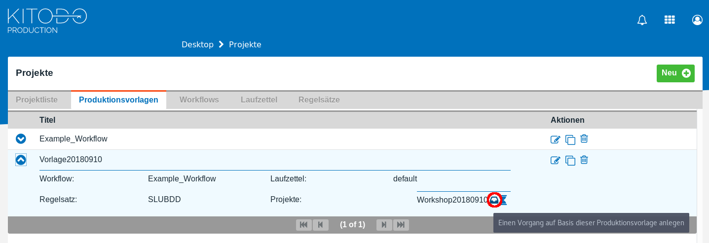

kitodo-tutorials](../README.md) » [kitodo3](README.md) » 04_produktionsvorlage-anlegen-und-workflow-definieren.md

# Workflow definieren und Produktionsvorlage anlegen

In der Regel wird für jedes zu digitalisierende Objekt ein eigener Vorgang erstellt. Um nicht für jeden dieser Vorgänge die Arbeitsschritte neu festlegen zu müssen, können Produktionsvorlagen erstellt werden, die dann als Muster dienen. Eine Produktionsvorlage beinhaltet einen Workflow (die bei jedem Vorgang in bestimmter Reihenfolge zu erledigenden Arbeitsschritte), einen Regelsatz und einen Laufzettel.

Die grafische Erstellung von Workflows ist eine neue Funktionalität von Kitodo 3.x. Dazu wird der Standard [BPMN](http://www.bpmn.org/) verwendet und ein bestehender [Workflow-Editor von Camunda](https://camunda.com/products/modeler/) integriert.

http://localhost:8080/kitodo/pages/projects.jsf

- Login: `testAdmin`
- Passwort: `test`

## Aufgabe: Workflow-Editor kennenlernen

**Achtung:** In der Entwicklerversion ist das Speichern von Workflows noch nicht möglich. Außerdem ist die Benutzeroberfläche noch unübersichtlich, das wird noch überarbeitet. Im weiteren Verlauf des Workshops werden wir daher ausschließlich mit dem vorkonfigurierten Workflow `Example_Workflow` arbeiten. Machen Sie sich trotzdem versuchsweise mit dem neuen Workflow-Editor vertraut.

Menü `Projekte` / Tab `Workflows`

* Button `Neu` / `Neuer Workflow` klicken
* Dateiname vergeben
* Rechts in der Seitenleiste bei `Name` einen Namen für den Workflow vergeben
* Workflow zeichnen und Angaben vornehmen
  - Startpunkt im Diagramm anklicken und das erscheinende rechteckige Symbol (`Append task`) auswählen. Ein neuer Task wurde ergänzt. Vergeben Sie einen Namen und im Reiter `Task` ggf. weitere Parameter.
  - Als Abschluss verwenden Sie den zweiten Kreis (mit mehr Linienbreite, `Create EndEvent`)
- Da das Speichern noch nicht funktioniert, klicken Sie dann auf `Abbrechen`

## Aufgabe: Produktionsvorlage anlegen

Menü `Projekte` / Tab `Produktionsvorlagen`

* Produktionsvorlagentitel: `Vorlage20180910`
* Projekt: `Workshop20180910`
* Regelsatz: `SLUBDD`
* Laufzettel: `default`
* Workflow: `Example_Workflow`
* In Auswahlliste anzeigen: (ja)
* Aktiv: (ja)

## Aufgabe: Berechtigungen festlegen und Benutzergruppen zuweisen

Die neu erstellte Produktionsvorlage ist anschließend in der Liste unter dem Menüpunkt `Projekte`/ Tab `Produktionsvorlagen` erreichbar. Editieren Sie die Produktionsvorlage und wechseln Sie in den Tab `Aufgabenliste`. Hier wurde die Konfiguration aus dem Workflow (`Example_Workflow`) übernommen.

Über den Bearbeitungsbildschirm der einzelnen Aufgaben, können Sie Berechtigungen festlegen (z.B. Images lesen oder Metadaten bearbeiten) und Benutzer bzw. Benutzergruppen zuweisen. Legen Sie folgende Werte fest:

* Scanning
  * Rechte: `Images lesen` und `Images schreiben`
  * Benutzergruppen: `Administration` und `Scanning`
* QC
  * Rechte: `Images lesen`
  * Benutzergruppen: `Administration` und `QualityControl`
* Structure and metadata

  * Rechte: `Metadaten`
  * Benutzergruppen: `Administration` und `Metadata`
* Export DMS
  * Rechte: `Export DMS`
  * Benutzergruppen: `Administration` und `Projectmanagement`

## Ergebnis

Wenn alle Einstellungen vollständig sind, dann wird im Menü `Projekte` / Tab `Produktionsvorlagen` nach Aufklappen der neu erstellten Produktionsvorlage `Vorlage2018910` Folgendes angezeigt:

------

Vorige Seite: <a href="03_benutzerkonfiguration.md">3. Benutzerkonfiguration</a> | Nächste Seite: <a href="05_vorgaenge-anlegen.md">5. Vorgänge anlegen</a>

