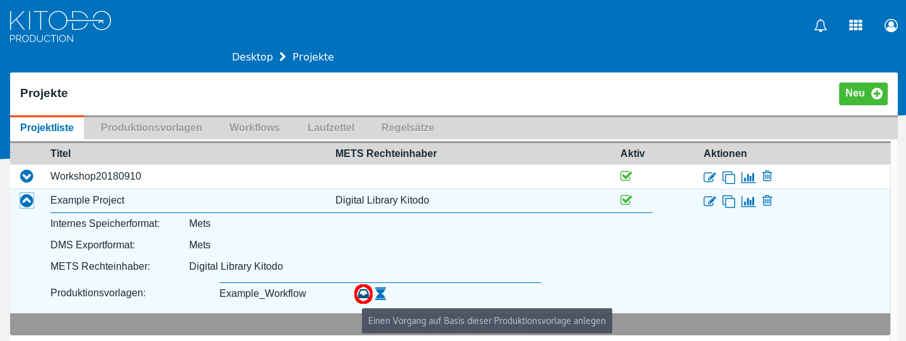
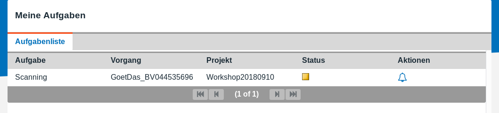

[kitodo-tutorials](../README.md) » [kitodo3](README.md) » 05_vorgaenge-anlegen.md

# Vorgänge anlegen

Im Workshop scannen wir Folgende von der TU Berlin bereitgestellte Monografie:

Das Strauch- und Schalenobst (1920, 48 S., 8. Bl.)

* [Katalogeintrag für das Original](http://gateway-bayern.de/BV024453565)
* [Katalogeintrag für das Digitalisat](http://gateway-bayern.de/BV044535696)
* [Digitalisate im Viewer](http://ubsrvgoobi2.ub.tu-berlin.de/viewer/resolver?urn=urn%3Anbn%3Ade%3Akobv%3A83-goobi-3224575)
* [TIF-Dateien zum Download](https://github.com/kitodo/kitodo-tutorials/tree/master/kitodo3/data)

Die Digitalisate der TU Berlin sind unter freien Lizenzen verfügbar, so dass Sie diese im Rahmen des Tutorials verwenden können (vgl. [Nutzungsbedingungen der TU Berlin](http://ubsrvgoobi2.ub.tu-berlin.de/viewer/nutzungsbedingungen/)).

http://localhost:8080/kitodo/pages/projects.jsf

- Login: `testAdmin`
- Passwort: `test`

## Aufgabe: Vorgang anlegen

Rufen Sie den Menüpunkt `Projekte` / Tab `Projektliste` auf und klappen Sie das Projekt `Workshop20180910` auf. Dann sollte dort folgende Auswahlmöglichkeit erscheinen.

Drücken Sie den im Bild markierten Button (es hat übrigens den gleichen Effekt, wenn Sie im Tab `Produktionsvorlagen` die Produktionsvorlage `Vorlage20180910` aufklappen und dort den Button beim Projekt `Workshop20180910` benutzen).

Legen Sie im folgenden Bildschirm einen Vorgang an. Geben Sie folgende Daten an:

* Tab `Zusätzliche Details`: 
  * Schrifttyp: `Antiqua`
  * Titel: `Das Strauch- und Schalenobst`
  * Titel (Sortierung): `Strauch- und Schalenobst`
  * Autoren: `Goethe, Rudolf ; Junge, Erwin`
  * PPN analog a-Satz: `BV024453565`
  * PPN digital a-Satz: `BV044535696`
  * Erscheinungsort: `Wiesbaden`
  * Erscheinungsjahr: `1920`
  * Verlag: `Bechtold`
  * Signatur: `4Bf3646`
* Tab `Vorgangsdaten`:
  * Klicken Sie auf den Zahnrad-Button neben dem Eingabefeld Vorgangstitel (ein Vorgangstitel und TIF-Header werden automatisch generiert)
  * DocType: `Monographie`
  * Digitale Kollektionen: `Collection 2`

## Ergebnis

Wenn der Vorgang erfolgreich erstellt wurde, dann sollte im Menü [Aufgaben](http://localhost:8080/kitodo/pages/tasks.jsf) der Vorgang mit der Aufgabe `Scanning` erscheinen:

## Hinweise

*  Im Tab `Suche` gibt es die Möglichkeit, Kataloge vom GBV und von der ZDB abzufragen und Daten automatisch zu übernehmen. Diese Funktion ist in der Entwicklerversion nicht stabil verfügbar, wird aber zukünftig für diese und weitere Kataloge zur Verfügung stehen.

------

Vorige Seite: <a href="04_produktionsvorlage-anlegen-und-workflow-definieren.md">4. Produktionsvorlage anlegen und Workflow definieren</a> | Nächste Seite: <a href="06_scannen.md">6. Scannen</a>

