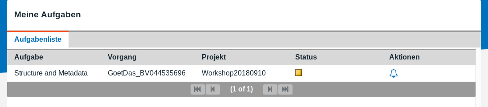

[kitodo-tutorials](../README.md) » [kitodo3](README.md) » 06_scannen.md

# Scannen

Die erste Aufgabe im Workflow unseres Vorgangs lautet `Scanning`. Andere Vorgänge haben wir noch nicht angelegt. Wenn wir daher den Menüpunkt `Aufgaben` mit dem Administrationsaccount aufrufen, steht allein diese Aufgabe zur Auswahl.

Bei einer Vielzahl von Vorgängen und verfügbaren Aufgaben kämen die Benutzergruppen und Berechtigungen ins Spiel, so dass ein/e Scanoperator/in, ein/e Bearbeiter/in von Meta- und Strukturdaten und die Projektmanager/in jeweils nur die für sie gerade verfügbaren Aufgaben zu Gesicht bekommt. Das erleichtert die Übersichtlichkeit und vermeidet Fehlbedienung.

Wir arbeiten in diesem Workshop weiter mit dem Administrationsaccount:

http://localhost:8080/kitodo/pages/tasks.jsf

- Login: `testAdmin`
- Passwort: `test`

## Aufgabe: Vorgang sperren

Menü `Aufgaben` 

* In der Liste der Vorgänge (hier nur ein Vorgang sichtbar) unter `Aktionen` den Klingel-Button ("Die Bearbeitung dieser Aufgabe übernehmen") anklicken

Damit ist diese Aufgabe für andere BenutzerInnen gesperrt, bis diese abgeschlossen oder wieder freigegeben wird. Das Verzeichnis mit den Bilddateien dieses Vorgangs wird für den Benutzer im Dateisystem unter  `/usr/local/kitodo/users/BENUTZERNAME` freigegeben.

**Achtung:** In der Entwicklerversion ist noch ein Fehler, so dass der Symlink ins Leere zeigt. Verbinden Sie sich via SSH mit dem Server und geben Sie folgende Befehle auf der Kommandozeile als Workaround ein:

```
sudo mkdir /usr/local/kitodo/metadata/2/images
sudo chown tomcat8:tomcat8 /usr/local/kitodo/metadata/2/images
```

Wenn Sie den gleichen Vorgangstitel verwendet haben, dann können die Bilddateien nun über den Symlink  `/usr/local/kitodo/users/testAdmin/GoetDas_BV044535696__[2]` bzw. direkt in das Verzeichnis `/usr/local/kitodo/metadata/2/images` eingespielt werden. Die Symlinks im Dateisystem sind die Grundlage, um diese benutzerspezifisch mit Webdav oder Samba bereitzustellen.

## Aufgabe: Bildateien auf den Server laden

Ein Webdav-Server gehört nicht zum Funktionsumfang von Kitodo.Production, daher spielen wir in diesem Workshop die Bilddateien manuell auf den Server. Verbinden Sie sich mit dem Server via SSH und geben Sie folgende Befehle ein:

```
sudo mkdir /usr/local/kitodo/metadata/2/images/tif
for i in {01..77}; sudo wget https://raw.githubusercontent.com/kitodo/kitodo-tutorials/master/kitodo3/data/rudolf-goethe_das-strauch-und-schalenobst_$i.tif -P /usr/local/kitodo/metadata/2/images/tif; done
```

Falls Sie mehrere Vorgänge angelegt haben, müssen Sie ggf. das Verzeichnis anpassen.

## Aufgabe: Aufgabe abschließen

Menü `Aufgaben` 

- In der Liste der Vorgänge unter `Aktionen` den ausgefüllten Klingel-Button anklicken
- Link `Die Bearbeitung dieser Aufgabe abschließen` klicken
- Ergebnis: Der Vorgang hat jetzt die Aufgabe `QC` (nächster Schritt im Workflow)

## Aufgabe: QualityControl überspringen

Menü `Vorgänge`

* Unter `Aktionen` den ersten Button (`Vorgang bearbeiten`) anklicken
* Dann im Tab `Aufgabenliste`
  * zweimal den Pfeil-nach-rechts-Button in Zeile 2 (`QC`) drücken (der Status wechselt auf grün)
  * einmal den Pfeil-nach-rechts-Button in Zeile 3 (`Structure and Metadata`) drücken (der Status wechselt auf gelb)

## Ergebnis

Im Menü [Aufgaben](http://localhost:8080/kitodo/pages/tasks.jsf) sollte nun als nächste Aufgabe die Erfassung der Struktur- und Metadaten anstehen:




------

<p align="center">Vorige Seite: <a href="05_vorgaenge-anlegen.md">5. Vorgänge anlegen</a> | Nächste Seite: <a href="07_paginierung-definieren.md">7. Paginierung definieren</a></p>
