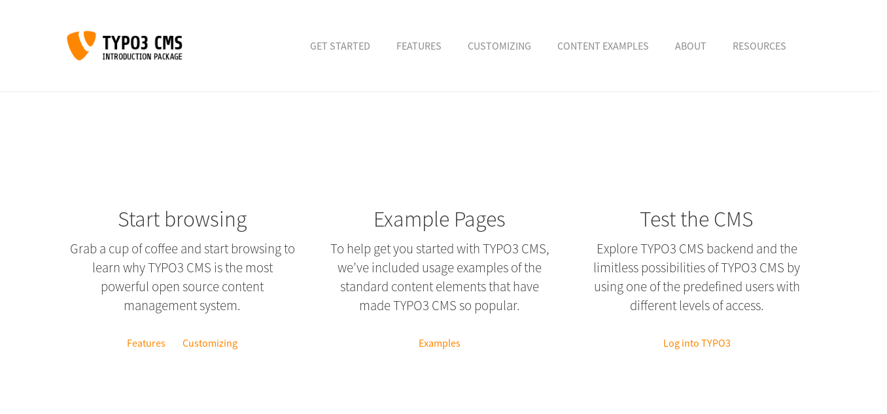
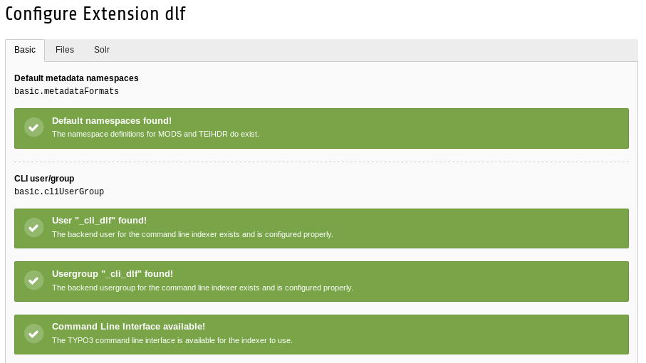
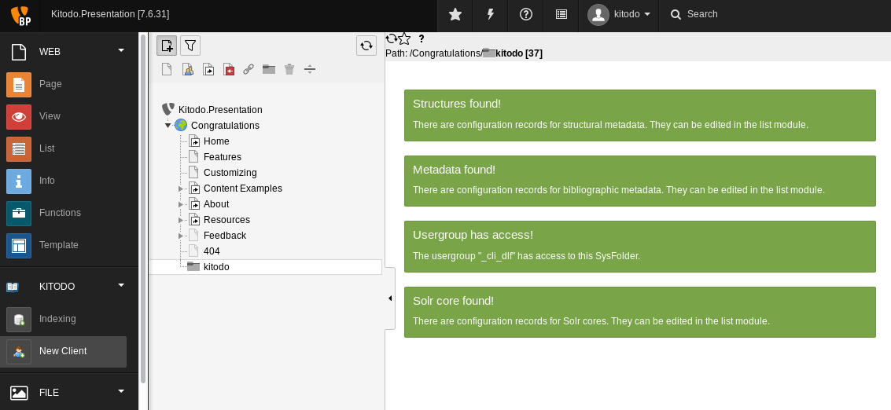
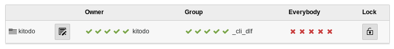

[kitodo-tutorials](../README.md) » [kitodo3](README.md) » 12_installation-kitodo-presentation.md

# Installation Kitodo.Presentation

In der vorliegenden Arbeitsumgebung unter Debian 9 (vgl. Kapitel [1. Arbeitsumgebung](01_arbeitsumgebung.md)) sind bereits folgende Services installiert, die wir auch für Kitodo.Presentation benötigen:

* MySQL 5.7
* Tomcat 8
* OpenJDK 8

Wir verwenden den zum Zeitpunkt des Workshops (September 2018) aktuellen Release [2.2.0](https://www.kitodo.org/news/2017/12/27/kitodopresentation-220/) von Kitodo.Presentation, der am 10.1.2018 im [Extension Repository von TYPO3](https://extensions.typo3.org/extension/dlf/) veröffentlicht wurde. Die Version 2.2.0 ist nicht mit den neuesten Versionen von TYPO3 und Solr kompatibel. Daran wird gerade gearbeitet ([Ticket für TYPO3 8.x Kompatibilität](https://github.com/kitodo/kitodo-presentation/issues/264), [Ticket für Solr 7.x Kompatibilität](https://github.com/kitodo/kitodo-presentation/issues/295)). Wir installieren hier daher folgende ältere Versionen:

* TYPO3 7.x
* Solr 3.6.2

Ausgangspunkt:

- SSH Login mit Account `kitodo` / `Workshop20180910`
- Benutzerverzeichnis von Account kitodo ( `cd ~`)

## TYPO3 installieren

### Apache und PHP installieren

```
sudo apt install apache2 libapache2-mod-php7.0 php7.0 php7.0-mysql php-gd php-json php-imagick php-mbstring php-curl php-apcu php-soap php-xml php-zip
```

### Datenbank anlegen

```
sudo mysql
CREATE DATABASE typo3 DEFAULT CHARACTER SET utf8;
CREATE USER typo3_db_user@localhost IDENTIFIED BY 'secretpassword';
GRANT ALL PRIVILEGES ON typo3.* TO typo3_db_user@localhost;
FLUSH PRIVILEGES;
quit;
```

### Konfiguration von PHP für TYPO3

```
sudo sed -i 's/max_execution_time = 30/max_execution_time = 240/' /etc/php/7.0/apache2/php.ini
sudo sed -i 's/; max_input_vars = 1000/max_input_vars = 1500/' /etc/php/7.0/apache2/php.ini
sudo sed -i 's/upload_max_filesize = 2M/upload_max_filesize = 8M/' /etc/php/7.0/apache2/php.ini
sudo /etc/init.d/apache2 restart
```

### Download TYPO3 7.x in /var/www/

```
curl -L -o typo3_src.tgz get.typo3.org/7
sudo mkdir /var/www/dlf /var/www/dlf/htdocs
sudo tar -xvzf typo3_src.tgz -C /var/www/dlf/
sudo chown www-data:www-data -R /var/www/dlf
(cd /var/www/dlf/htdocs && sudo ln -s ../typo3_src* typo3_src && sudo ln -s typo3_src/typo3 typo3 && sudo ln -s typo3_src/index.php index.php)
sudo touch /var/www/dlf/htdocs/FIRST_INSTALL
```

### Einrichtung Apache VirtualHost

```
sudo sh -c 'echo "<VirtualHost *:80>
        DocumentRoot /var/www/dlf/htdocs
        ServerName kitodo-presentation
        Options -Indexes
        DirectoryIndex index.php index.html
</VirtualHost>" > /etc/apache2/sites-available/kitodo-presentation.conf'
sudo a2ensite kitodo-presentation.conf
sudo a2dissite 000-default.conf
sudo service apache2 reload
```

### Grundinstallation mit TYPO3 Install Tool

http://localhost

* Schritt 1: Button "System looks good. Continue!" drücken
* Schritt 2:
  * username: `typo3_db_user`
  * password: `secretpassword`
* Schritt 3: use an existing empty database `typo3`
* Schritt 4:
  * username: `kitodo`
  * password: `Workshop20180910`
  * site name: `Kitodo.Presentation`
* Schritt 5: `Yes, download the list of distributions.`


* Login
  * username: `kitodo`
  * password: `Workshop20180910`
* Menü `Extensions` / `Get preconfigured distribution` (sollte vorausgewählt sein)
  * Button `Install` bei "The official Introduction Package" drücken

### Zwischenergebnis TYPO3

Die Webseite sollte jetzt unter http://localhost erreichbar sein und sollte wie folgt aussehen. Das Administrationsmenü ist ab sofort unter http://localhost/typo3 zu finden.



## Extension Kitodo.Presentation (dlf) installieren

### Anpassung TYPO3-Konfiguration

Zunächst müssen wir noch eine Konfigurationsänderung an unserer TYPO3-Installation vornehmen, weil sonst später die Kommunikation zwischen der Extension Kitodo.Presentation und der MySQL-Datenbank fehlschlägt. Diese Änderung ist ab MySQL 5.7 notwendig.

```
sudo sed -i "/t3lib_cs_utils/a \ \ \ \ \ \ \ \ 'setDBinit' => 'SET SESSION sql_mode=\"\"'," /var/www/dlf/htdocs/typo3conf/LocalConfiguration.php
```

Weiterhin unterstützen Teile der Plugins von Kitodo.Presentation (z.B. `Navigation` und `Search`) das in TYPO3 7.x voreingestellte Feature cHash nicht. Wir müssen daher die Zwangsumleitung bei einem CHash-Fehler ausschalten:

```
sudo sed -i "/'FE'/a \ \ \ \ \ \ \ \ 'pageNotFoundOnCHashError' => '0'," /var/www/dlf/htdocs/typo3conf/LocalConfiguration.php
```

### Installation über den Extension Manager von TYPO3

http://localhost/typo3

* username: `kitodo`
* password: `Workshop20180910`

Menü `Extensions` / `Get Extensions` (Pulldown-Menü ganz oben auf der Seite)

* Suche nach `Kitodo`, es sollte Extension `Kitodo.Presentation` mit Key `dlf` in Version `2.2.0` angezeigt werden
* Wolken-Button bei `Actions` drücken, um die Extension zu installieren (nach einer kurzen Zeit erscheint die Statusmeldung `dlf installed`)

## Solr 3.6.2 installieren

Bevor wir Kitodo.Presentation konfigurieren, müssen wir zunächst die Suchmaschine Solr installieren. Wie oben geschrieben, erwartet Kitodo 2.2.0 eine ältere Version von Solr.

### Solr herunterladen und in /home/solr installieren

Kitodo.Presentation erwartet in der Standardeinstellung das Archiv der Solr-Webapplikation (.war) unter `/home/solr/apache-solr-for-kitodo.war`

```
wget http://archive.apache.org/dist/lucene/solr/3.6.2/apache-solr-3.6.2.tgz
tar -xzvf apache-solr-3.6.2.tgz --strip-components=2 apache-solr-3.6.2/dist/apache-solr-3.6.2.war
sudo mkdir /home/solr
sudo mv apache-solr-3.6.2.war /home/solr/apache-solr-for-kitodo.war
```

### Mitgelieferte Konfigurationsdateien kopieren

Kitodo.Presentation liefert Konfigurationsdateien für Solr und Tomcat mit, die in die entsprechenden Verzeichnisse kopiert werden müssen.

```
sudo cp -r /var/www/dlf/htdocs/typo3conf/ext/dlf/lib/ApacheSolr/* /home/solr/
sudo chown -R tomcat8:tomcat8 /home/solr
sudo cp /var/www/dlf/htdocs/typo3conf/ext/dlf/lib/ApacheSolr/conf/solr.xml /var/lib/tomcat8/conf/Catalina/localhost/solr.xml
sudo chown -R tomcat8:tomcat8 /var/lib/tomcat8/
```

### Zwischenergebnis Solr

Nach einigen Sekunden Startzeit sollte Solr nun unter der Adresse http://localhost:8080/solr erreichbar sein.


## Extension Kitodo.Presentation (dlf) konfigurieren

### Grundkonfiguration

http://localhost/typo3

Menü `Extensions` / `Installed Extensions` (Pulldown-Menü ganz oben auf der Seite)

- Suche nach `Kitodo` und dann dort rechts unter `Actions` den Zahnrad-Button (`Configure`) drücken
- Tab `Basic`
  - Checkbox bei `Create and configure CLI user/group automatically` anklicken und Save-Button drücken
  - Dann Checkbox wieder deaktivieren und nochmal Save-Button drücken (jetzt sollten alle Statusmeldungen grün sein)



* Tab `Solr`
  * Solr Server Port: `8080` 
  * Save-Button drücken (beim erneuten Aufruf des Tabs `Solr` sollte jetzt die Statusmeldung `Connection established!` erscheinen)


### Datenspeicher anlegen

Menü `List`
* Oben links den Plus-Button drücken (dadurch erscheinen mehrere Icons in der Zeile darunter zur Auswahl)
* Das Icon für den Dateiordner (dunkelgraue Akte) per Drag und Drop auf die Seite `Congratulations` ziehen. Als Name `kitodo` eingeben
* Rechte Maustaste auf den neuen Dateiordner `kitodo` und im Kontextmenü `Enable` auswählen (das Einbahnstraßensymbol verschwindet)

### Grundkonfiguration automatisch erstellen

Menü `New Client` (unter der Kategorie `Kitodo`)

* Den Dateiordner `kitodo` auswählen (falls schon ausgewählt, nochmal anklicken)


* Es erscheinen nun vier Statusmeldungen. Klicken Sie nacheinander alle 4 Links an (z.B. `Add basic configuration`). Anschließend sollten nur noch grüne Statusmeldungen zu sehen sein.



### Berechtigungen setzen

Menü `Access` (unter der Kategorie `System`)

* Den Dateiordner `kitodo` auswählen (falls schon ausgewählt, nochmal anklicken)
* Im rechten Teil der Seite in der Tabelle bei `Group` auf den Namen `Simple Editors` klicken, über das Pulldownmenü auf den Wert `_cli_dlf` ändern und direkt daneben den Disketten-Button drücken.





------

<p align="center">Vorige Seite: <a href="07_paginierung-definieren.md">7. Paginierung definieren</a> | Nächste Seite: <a href="13_daten-indexieren.md">13. Daten indexieren</a></p>