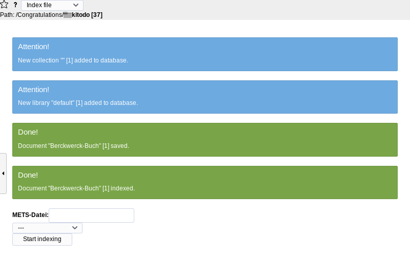
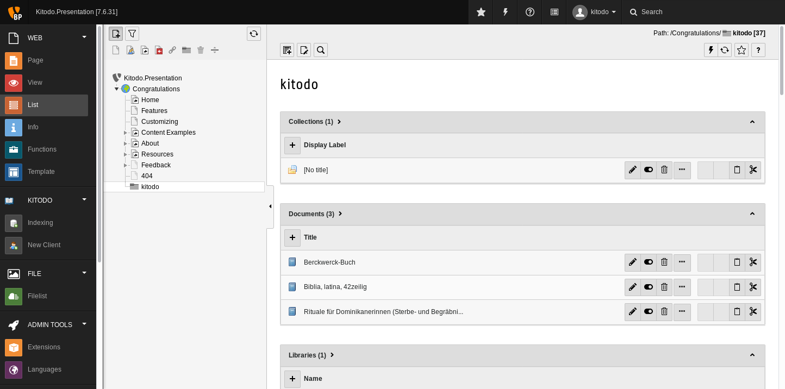

[kitodo-tutorials](../README.md) » [kitodo3](README.md) » 13_daten-indexieren.md

# Daten indexieren

Da wir den Teil Kitodo.Production mit der Entwicklerversion nicht abschließen konnten, indexieren wir frei verfügbare METS-Beispieldaten. Als Beispiel nutzen wir hier die [Virtuelle Schatzkammer der SLUB Dresden](https://digital.slub-dresden.de/kollektionen/27), deren Daten über eine [OAI-Schnittstelle](http://digital.slub-dresden.de/oai/?verb=ListIdentifiers&metadataPrefix=mets&set=virtual-treasure-chamber) abrufbar sind.

## Aufgabe: Daten manuell indexieren

Menü `Indexing`

* Den Dateiordner `kitodo` auswählen (falls schon ausgewählt, nochmal anklicken)
* METS-Datei: `http://digital.slub-dresden.de/oai/?verb=GetRecord&metadataPrefix=mets&identifier=oai:de:slub-dresden:db:id-264312570`
* Darunter `Solr Core (PID 37)` auswählen
* Button `Start indexing` drücken



## Aufgabe: Daten über die Kommandozeile indexieren

Alternativ gibt es die Möglichkeit die Indexierung über ein Kommandozeileninterface zu steuern. Dieses ist über den Command Line Interface Dispatcher von TYPO3 realisiert. Das Tool ist mit dem folgenden Befehl aufrufbar:

```
/var/www/dlf/htdocs/typo3/cli_dispatch.phpsh dlf
```

Es bietet zwei Tasks an: `index` und `reindex`. Beim Indexieren müssen folgende Parameter angegeben werden:

* `-doc UID/URL` (Datei im Dateisystem oder Link zur METS Datei)
* `-pid UID` (TYPO3 page id des Dateiordners, in dem die Records gespeichert werden sollen)
* `-core UID` (ID des Solr Cores, der von Kitodo.Presentation angelegt wurde)

Ein vollständiger Befehl zur Indexierung des oben manuell hinzugefügten Beispiels lautet:

```
/var/www/dlf/htdocs/typo3/cli_dispatch.phpsh dlf index -doc "http://digital.slub-dresden.de/oai/?verb=GetRecord&metadataPrefix=mets&identifier=oai:de:slub-dresden:db:id-264312570" -pid 37 -core 0
```

Die Fehlermeldung `Oops, an error occurred: The APCu backend cannot be used because apcu is disabled on CLI.` verhindert nicht die erfolgreiche Indexierung. Wenn Sie diese Meldung trotzdem abstellen wollen, müssen Sie die PHP-Konfiguration wie folgt ändern:

```
sudo sh -c "echo 'apc.enable_cli=1' >> /etc/php/7.0/cli/conf.d/20-apcu.ini"
```

**Aufgabe:** Indexieren Sie die folgenden weiteren METS-Dateien über die Kommandozeile:

- `http://digital.slub-dresden.de/oai/?verb=GetRecord&metadataPrefix=mets&identifier=oai:de:slub-dresden:db:id-316102288`
- `http://digital.slub-dresden.de/oai/?verb=GetRecord&metadataPrefix=mets&identifier=oai:de:slub-dresden:db:id-279347316`

## Ergebnis

Wenn alle drei METS-Dateien erfolgreich indexiert wurden, dann sollte der Dateiordner `kitodo` wie folgt aussehen:




------

<p align="center">Vorige Seite: <a href="12_installation-kitodo-presentation.md">12. Installation Kitodo.Presentation</a> | Nächste Seite: <a href="14_anzeige-konfigurieren.md">14. Anzeige konfigurieren</a></p>