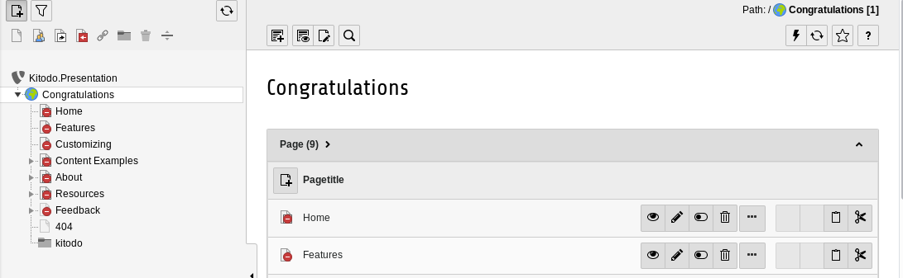
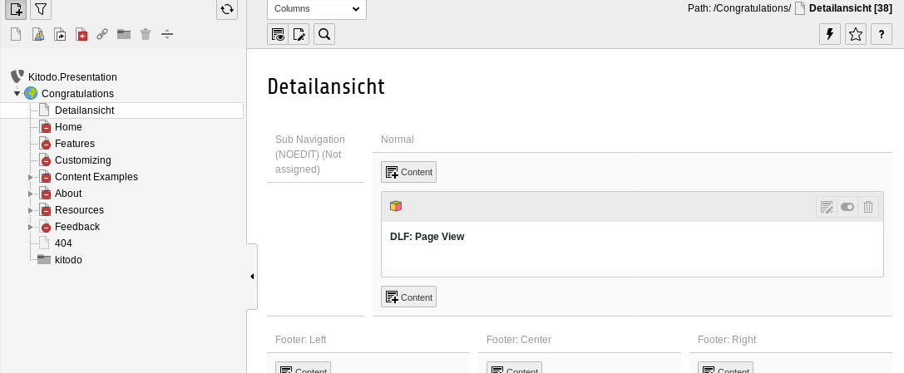
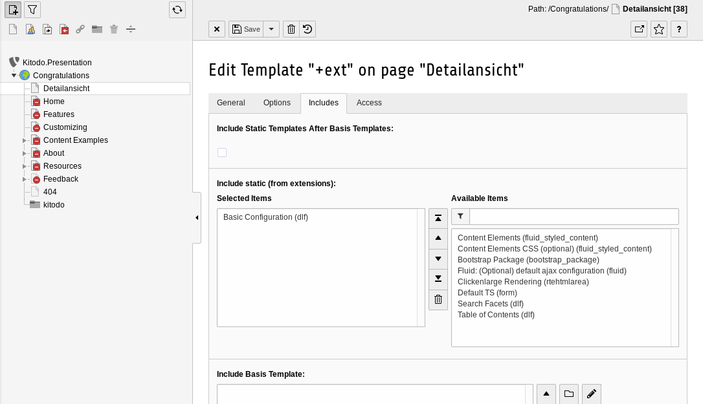
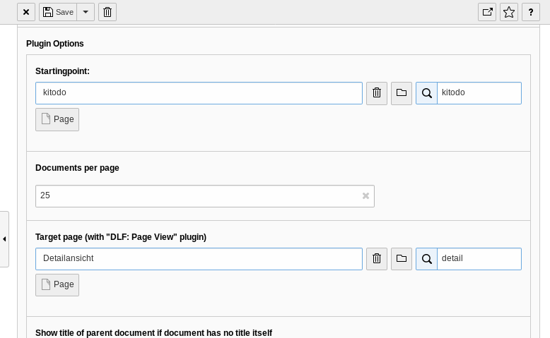
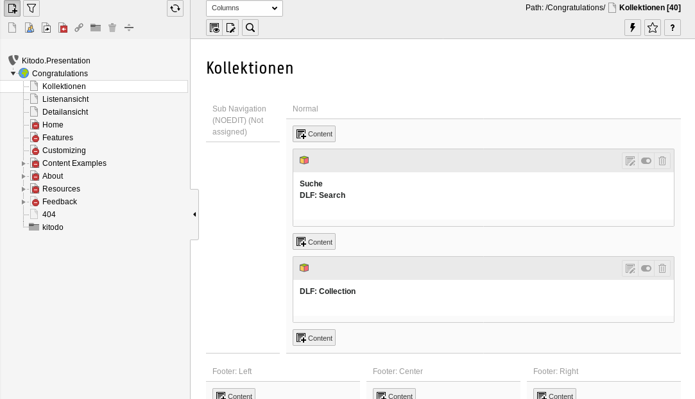
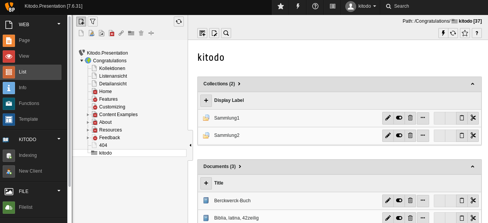
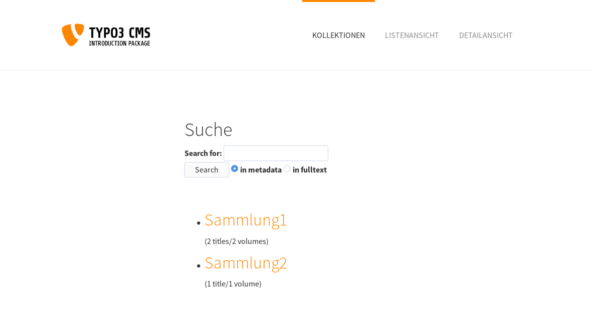
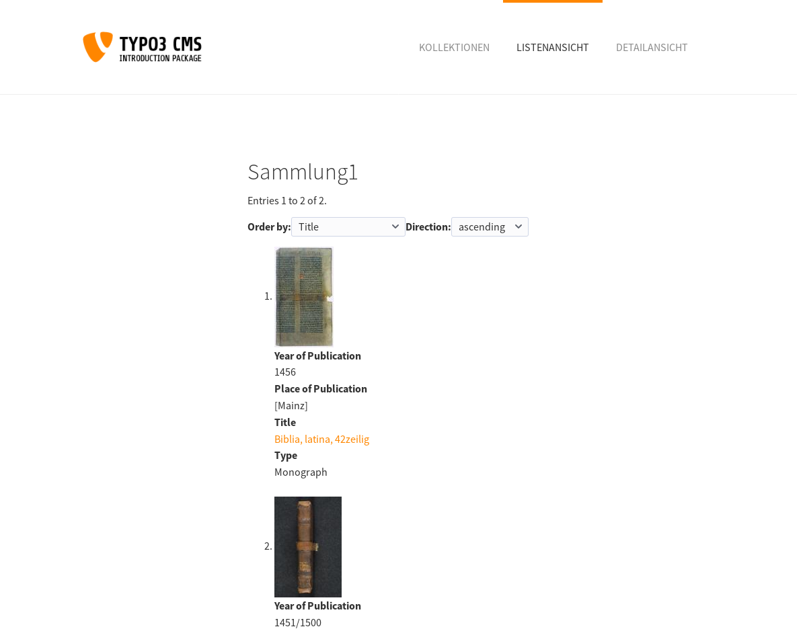

[kitodo-tutorials](../README.md) » [kitodo3](README.md) » 14_anzeige-konfigurieren.md

# Anzeige konfigurieren

Die Extension Kitodo.Presentation ist modular aufgebaut und bietet eine ganze Reihe von Plugins, die auf beliebigen TYPO3-Seiten eingebunden werden können. Wir nutzen im Folgenden nur vier der insgesamt 16 Plugins:

* `DLF: Search`: Ein Suchschlitz
* `DLF: Collection`: Eine Übersichtsseite für die Kollektionen
* `DLF: List view`: Eine Listenansicht der ausgewählten Digitalisate
* `DLF: Page view`: Eine Detailansicht eines Digitalisats

In der Konfiguration müssen Verweise auf Folgeseiten eingestellt werden (z.B. von `Search` zu `List view` und von `List view` zu `Page view`, so dass wir mit der untersten Ebene (`DLF: Page view`) beginnen.

## Aufgabe: Nicht benötigte Menüpunkte ausblenden

Zunächst deaktivieren wir die zahlreichen Beispielseiten, die das Introduction Package von TYPO3 automatisch angelegt hat. 

Menü `List`

* Rechtsklick auf die Seite `Home` und im Kontextmenü `Disable auswählen`
* Wiederholen Sie das Vorgehen mit den folgenden Seiten: `Features`, `Customizing`, `Content Examples`, `About`, `Resources` und `Feedback`.

## Aufgabe: Seite Detailansicht mit Plugin Page view erstellen

### Neue Seite anlegen und Plugin einrichten

Menü `Page`

* Rechtsklick auf die Seite `Congratulations` und im Kontextmenü `Page Actions` / `New` auswählen.
  * Als Position den Pfeil zwischen `Congratulations` und `Home` auswählen
  * Tab `General` / Page Title: `Detailansicht`
  * Tab `Access` / Checkbox `Disable` deaktivieren
  * Save Button drücken
* Im Seitenbaum links die Seite `Detailansicht` anklicken und im rechten Teil den Button `+ Content` unter der Überschrift `Normal` anklicken
  * Unter Tab `Plugins` das Element `General Plugin` anklicken
  * Nun unter `Selected Plugin` das Plugin `DLF: Page View` auswählen und den Dialog `Refresh required` mit `OK` bestätigen.
  * Bei `Plugin Options` / `Startingpoint` rechts in das Suchfeld `kitodo` eintippen und den Dateiordner auswählen.
  * Save Button drücken

### Template konfigurieren

Menü `Template`

* Seite `Detailansicht` aufrufen und rechts den Button `Click here to create an extension template` drücken
* Oben im Pulldown-Menü `Info/Modify` auswählen und Button `Edit the whole template record` drücken
  * Das Plugin `DLF: Page View` nutzt OpenLayers und erfordert eine zusätzliche Stylesheet-Einstellung. Im Tab `General` unter Setup dazu folgenden Text in Zeile 1 eingeben:
    * `page.CSS_inlineStyle ( .tx-dlf-map { width:100%; height:100%; } )` 
  * Im Tab `Includes` den Eintrag `Basic Configuration (dlf)` unter `Available Items` auswählen.
  * Save Button drücken

## Aufgabe: Seite Listenansicht mit Plugin List view erstellen

Menü `Page`

- Rechtsklick auf die Seite `Congratulations` und im Kontextmenü `Page Actions` / `New` auswählen.
  - Als Position den Pfeil zwischen `Congratulations` und `Detailansicht` auswählen
  - Tab `General` / Page Title: `Listenansicht`
  - Tab `Access` / Checkbox `Disable` deaktivieren
  - Save Button drücken
- Im Seitenbaum links die Seite `Listenansicht` anklicken und im rechten Teil den Button `+ Content` unter der Überschrift `Normal` anklicken
  - Unter Tab `Plugins` das Element `General Plugin` anklicken
  - Nun unter `Selected Plugin` das Plugin `DLF: List View` auswählen und den Dialog `Refresh required` mit `OK` bestätigen.
  - Bei `Plugin Options` / `Startingpoint` rechts in das Suchfeld `kitodo` eintippen und den Dateiordner auswählen.
  - Bei `Plugin Options` / `Target page` rechts in das Suchfeld `Detailansicht` eintippen und die Seite auswählen
  - Save Button drücken

### Template konfigurieren

Menü `Template`

- Seite `Listenansicht` aufrufen und rechts den Button `Click here to create an extension template` drücken
- Button `Edit the whole template record` drücken
  - Im Tab `Includes` den Eintrag `Basic Configuration (dlf)` unter `Available Items` auswählen.
  - Save Button drücken

## Aufgabe: Seite Kollektionen mit Plugins Collection und Search erstellen

Menü `Page`

- Rechtsklick auf die Seite `Congratulations` und im Kontextmenü `Page Actions` / `New` auswählen.
  - Als Position den Pfeil zwischen `Congratulations` und `Listenansicht` auswählen
  - Tab `General` / Page Title: `Kollektionen`
  - Tab `Access` / Checkbox `Disable` deaktivieren
  - Save Button drücken
- Im Seitenbaum links die Seite `Kollektionen` anklicken und im rechten Teil den Button `+ Content` unter der Überschrift `Normal` anklicken
  - Unter Tab `Plugins` das Element `General Plugin` anklicken
  - Nun unter `Selected Plugin` das Plugin `DLF: Collection` auswählen und den Dialog `Refresh required` mit `OK` bestätigen.
  - Bei `Plugin Options` / `Startingpoint` rechts in das Suchfeld `kitodo` eintippen und den Dateiordner auswählen.
  - Bei `Plugin Options` / `Target page` rechts in das Suchfeld `Listenansicht` eintippen und die Seite auswählen
  - Save Button drücken
- Im Seitenbaum links die Seite `Kollektionen` anklicken und im rechten Teil den Button `+ Content` unter der Überschrift `Normal` anklicken
  - Unter Tab `Plugins` das Element `General Plugin` anklicken
  - Unter `Header` den Wert `Suche` eingeben
  - Unter `Selected Plugin` das Plugin `DLF: Search` auswählen und den Dialog `Refresh required` mit `OK` bestätigen.
  - Bei `Plugin Options` / `Startingpoint` rechts in das Suchfeld `kitodo` eintippen und den Dateiordner auswählen.
  - Bei Frage `Enable fulltext search?` den Wert `yes` auswählen
  - Bei `Plugin Options` / `Target page` rechts in das Suchfeld `Listenansicht` eintippen und die Seite auswählen
  - Save Button drücken

### Template konfigurieren

Menü `Template`

- Seite `Listenansicht` aufrufen und rechts den Button `Click here to create an extension template` drücken
- Button `Edit the whole template record` drücken
  - Im Tab `Includes` den Eintrag `Basic Configuration (dlf)` unter `Available Items` auswählen.
  - Save Button drücken

### Daten in zwei Kollektionen aufteilen

Menü `List`

* Den Dateiordner `kitodo` auswählen (falls schon ausgewählt, nochmal anklicken)
* Die vorhandene Collection `no title` bearbeiten
  * `Display Label`: `Sammlung1`
  * Save Button drücken
* Eine neue Collection über den Plus-Button neben `Display Label` anlegen
  * `Display Label`: `Sammlung2`
  * Save Button drücken
* Unter Documents den Eintrag `Berkwerk-Buch` bearbeiten
  * Unten auf der Seite unter Collections die vorhandene Collection `Sammlung1` entfernen und rechts unter `Available Items` die Collection `Sammlung2` anklicken.
  * Save Button drücken

## Ergebnis

**Achtung:** Es besteht noch ein Fehler im Zusammenspiel zwischen dem Page View Plugin und dem Introduction Package. Auf der Seite Detailansicht wird leider nichts angezeigt. Sobald der Fehler analysiert und behoben wurde, wird das Tutorial an dieser Stelle angepasst.

Die anderen beiden Seiten sollten aber nach Erledigung der obigen Aufgaben unter http://localhost aufrufbar sein und wie folgt aussehen:

## Weitere Funktionen

Kitodo.Presentation verfügt über einen umfangreichen Funktionsumfang, den die meisten Anwender nur in Auszügen nutzen. Auf der [Webseite zu Kitodo.Presentation](https://www.kitodo.org/software/kitodopresentation/) finden Sie einige Anwendungsbeispiele. Der Kitodo e.V. plant derzeit eine Referenzinstallation mit einem neutralen Stylesheet und umfangreichen Beispieldaten, welche den vollständigen Funktionsumfang demonstrieren soll.

------

Vorige Seite: <a href="13_daten-indexieren.md">13. Daten indexieren</a>
